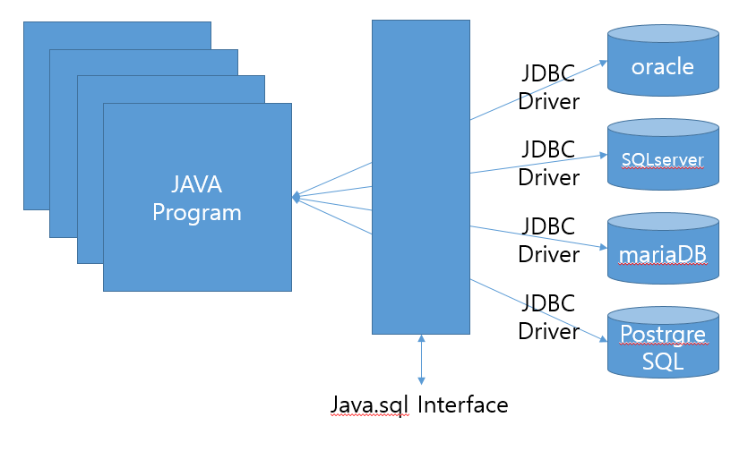

# JDBC

## **JAVA DATABASE CONNECTIVITY**

- 자바에서 데이터베이스에 접속할 수 있도록 하는 자바 API



## Driver Load

```java
// 로딩을 안해도 실행이 됨
Class.forName("org.mariadb.jdbc.Driver");
```

## Connection 객체 생성

```java
String url = "jdbc:mysql://서버IP:포트번호/DB명?charset=utf8";
Connection conn = DriverManager.getConnection(url, "ID", "PASSWORD");
```

## Statement 객체 생성 및 질의 수행

```java
// stmt.execute("query") - SQL
// stmt.executeQuery("query) - SELECT
// stmt.excuteUpdate("query") - INSERT, UPDATE, DELETE

// select query
String sql = "select * from dept"
Statement stmt = conn.createStatement();
ResultSet rs = stmt.executeQuery(sql);

// delete query
String sql = "delete from dept where no = '" + no + "'";
Statement stmt = conn.createStatement();
Statement stmt.executeUpdate(sql);

// insert query
String sql = "insert into dept values(null,'" + name + "')";
Statement stmt = conn.createStatement();
stmt.executeUpdate(sql);

// update query
String sql = "update dept set name = '" + vo.getName() + "' where no =" + vo.getNo();
Statement stmt = conn.createStatement();
stmt.executeUpdate(sql);
```

## Select Query

```java
ResultSet rs = stmt.executeQuery("query");
while(rs.next()) {
		System.out.println(rs.getint("no"));
}
```

## Statement 활용 - PreparedStatement

```java
String sql = "select * from dept where no = ?";
PreparedStatement pstmt = con.prepareStatement(sql);
pstmt.setInt(1,10);
ResultSet rs = pstmt.executeQuery();
```

## DAO ( Data Access Object )

- DB를 사용해서 데이터를 조회, 조작하는 기능을 전담하도록 만든 오브젝트

